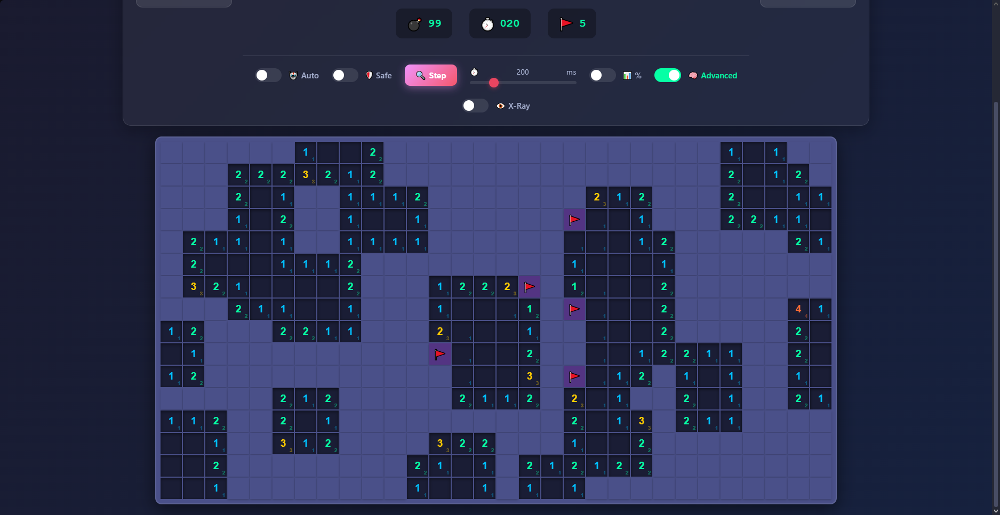
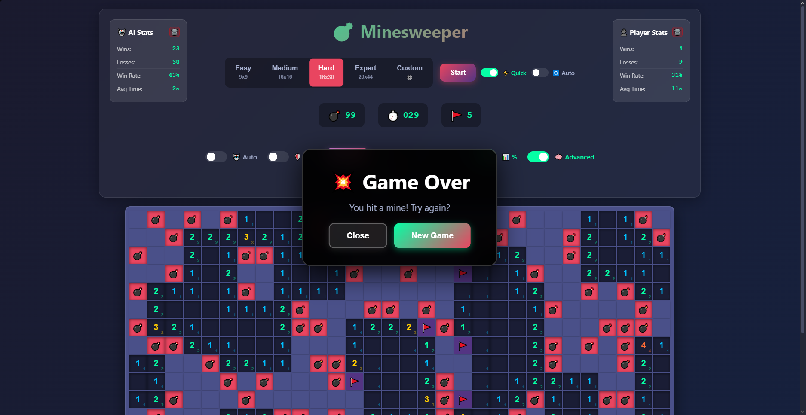
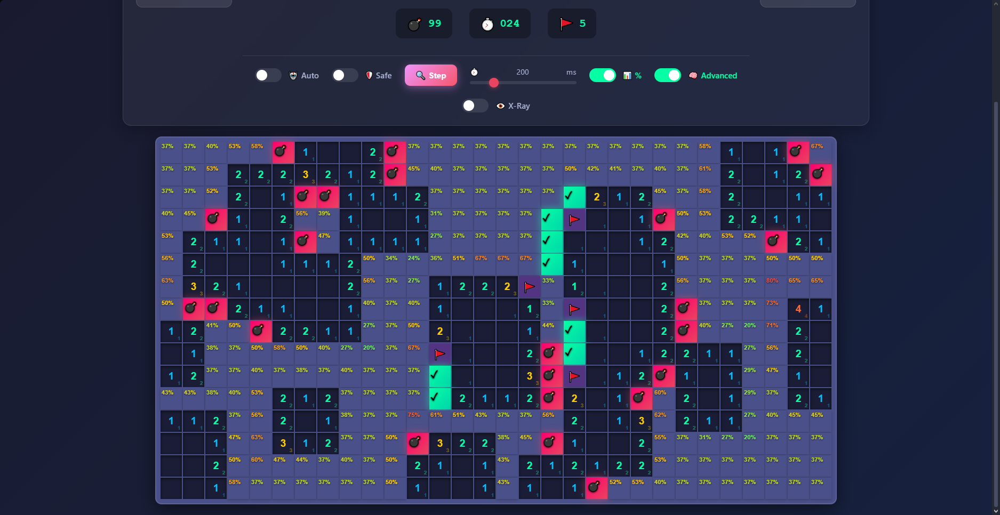
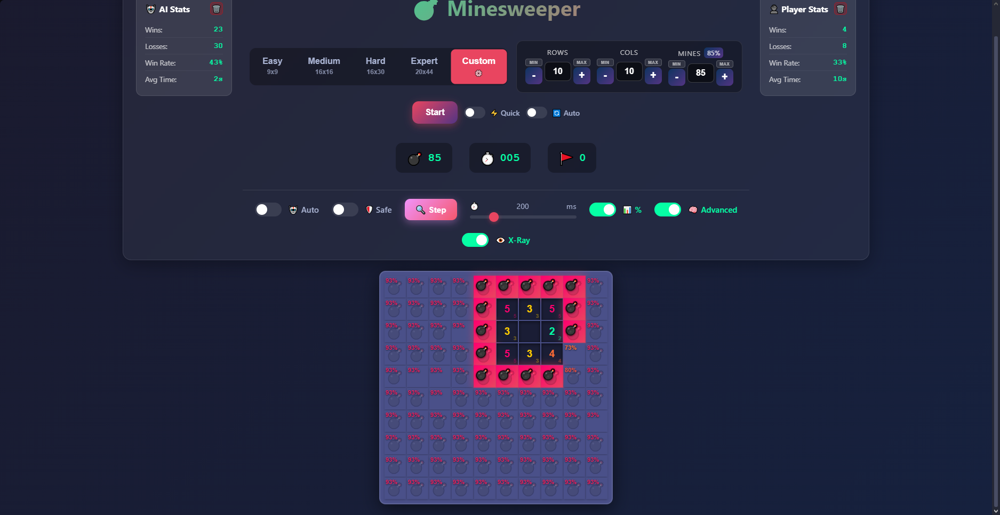
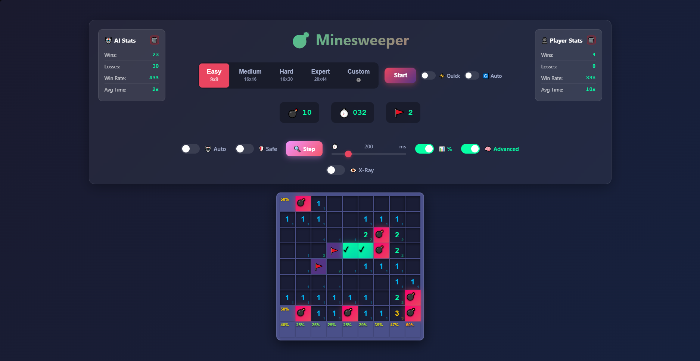
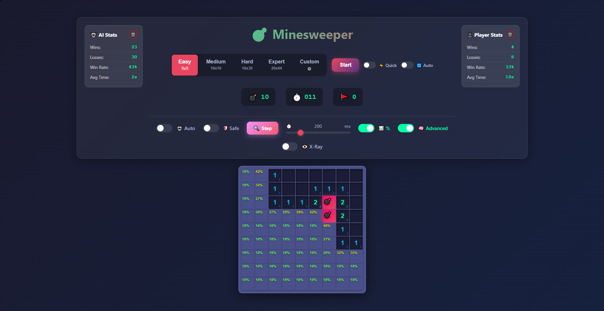
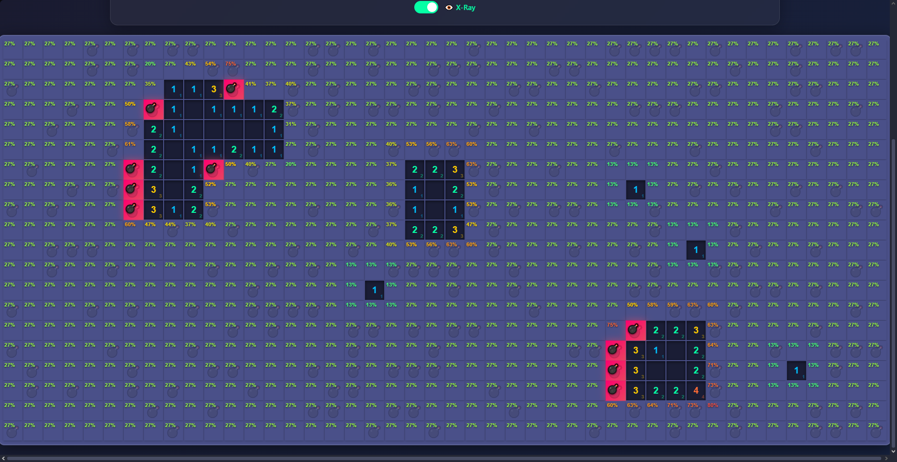

# 💣 Minesweeper

**🎮 [Play Now](https://drseedon.github.io/Minesweeper) | [English](#english) | [Русский](#russian)**

---

<a name="english"></a>
## 🇬🇧 English

Modern web version of the classic Minesweeper game with AI solver, probabilistic analysis, and detailed statistics.

## 🎮 Features

### 🎯 Game Modes
- **4 difficulty levels**: Easy (12%), Medium (16%), Hard (21%), Expert (25%)
- **Custom mode**: create your own field sizes (up to 50×44)
- **Quick Start**: instant reveal of all zero cells
- **Auto Restart**: automatic restart after game ends

### 🤖 AI Solver
- **Auto Mode**: full auto-solver with probabilistic analysis
- **Safe Mode**: AI makes only 100% safe moves
- **Step-by-Step**: execute AI one step at a time
- **Adjustable speed**: from 0 to 1000ms between moves

### 📊 Analytics
- **Probability visualization**: smooth gradient from green (safe) to red (mine)
- **Advanced mode**: shows remaining mines next to each number
- **X-Ray mode**: see mines through unrevealed cells
- **Detailed statistics**: separate for AI and player (wins, losses, win rate, avg time)

### 🎨 Interface
- **Modern design**: gradients, animations, blur effects
- **Tooltips**: hints for all interface elements
- **Responsive**: fits different screen sizes
- **Dark theme**: stylish purple-black design

## 📸 Screenshots
















## 🚀 Quick Start

### Run Locally

1. **Clone the repository:**
```bash
git clone https://github.com/drseedon/Minesweeper.git
cd Minesweeper
```

2. **Start local server:**

**Windows:**
```bash
start.bat
```

**Linux/Mac:**
```bash
python3 -m http.server 8000
```

3. **Open browser:**
```
http://localhost:8000
```

### GitHub Pages

The game is automatically deployed to GitHub Pages:
```
https://drseedon.github.io/Minesweeper
```

## 🎓 How to Play

### Basics
- **LMB** - reveal cell
- **RMB** - place/remove flag
- **Numbers** - count of mines in adjacent cells
- **Goal** - reveal all safe cells

### Advanced Techniques
1. **Logical analysis**: if a number N has N flags already, remaining neighbors are safe
2. **Probability calculation**: use % mode to assess risks
3. **Advanced mode**: track remaining mines next to each number

### AI Solver
1. Enable **Auto** or **Safe** mode
2. Adjust speed via slider
3. Use **Step** for step-by-step logic viewing
4. Enable **%** to see AI probabilities

## 📊 Difficulty Statistics

| Level   | Size   | Mines | % | Logic Solvability | AI Win Rate |
|---------|--------|-------|---|-------------------|-------------|
| Easy    | 9×9    | 10    | 12% | ~95-98% | ~90-95% |
| Medium  | 16×16  | 40    | 16% | ~80-90% | ~60-75% |
| Hard    | 16×30  | 99    | 21% | ~50-65% | ~35-50% |
| Expert  | 20×44  | 220   | 25% | ~40-55% | ~25-40% |

## 🛠 Technologies

- **Vanilla JavaScript** (ES6 Modules)
- **CSS3** (Grid, Flexbox, Animations, Gradients)
- **HTML5**
- **LocalStorage** for statistics

### Architecture
```
📁 js/
  ├── Game.js           # Main game logic
  ├── Board.js          # Game board and state
  ├── UI.js             # Rendering and DOM
  ├── Solver.js         # Basic AI solver
  ├── AdvancedSolver.js # Probabilistic AI
  ├── Tooltip.js        # Tooltip system
  ├── constants.js      # Constants and settings
  └── main.js           # Entry point

📁 css/
  ├── main.css          # Module imports
  ├── variables.css     # CSS variables
  ├── base.css          # Base styles
  ├── layout.css        # Layout structure
  ├── components.css    # UI components
  ├── cells.css         # Cell styles
  ├── overlay.css       # Overlays
  ├── animations.css    # Animations
  └── responsive.css    # Responsive design
```

## 🎯 Implementation Features

### AI Solver
- **Basic rules**: determining 100% safe/dangerous cells
- **Probabilistic analysis**: calculating odds for each unrevealed cell
- **CSP approach**: constraint satisfaction for complex patterns
- **Fallback strategy**: corner priority when no logical moves exist

### Field Generation
- **Safe start**: first click is always safe
- **3×3 safety zone**: no mines around first click
- **Quick Start mode**: center generation + reveal all zeros

### Statistics
- **Separate tracking**: AI vs Player
- **Persistent**: saved in LocalStorage
- **Metrics**: wins, losses, win rate, avg time
- **Clear**: individually for AI/Player

## 🤝 Contributing

Pull requests are welcome! For major changes, please open an issue first.

## 📝 License

MIT

## ⭐ Acknowledgments

Inspired by classic Windows Minesweeper and modern web technologies.

---

**Made with 💜 and TypeScript (just kidding, pure JS!)**

---

<a name="russian"></a>
## 🇷🇺 Русский

Современная веб-версия классической игры "Сапёр" с AI солвером, вероятностным анализом и детальной статистикой.

## 🎮 Возможности

### 🎯 Игровые режимы
- **4 уровня сложности**: Easy (12%), Medium (16%), Hard (21%), Expert (25%)
- **Custom режим**: создавай свои размеры поля (до 50×44)
- **Quick Start**: мгновенное открытие всех нулевых клеток
- **Auto Restart**: автоматический перезапуск после окончания игры

### 🤖 AI Солвер
- **Auto Mode**: полный автосолвер с вероятностным анализом
- **Safe Mode**: AI делает только 100% безопасные ходы
- **Step-by-Step**: выполнение AI по одному шагу
- **Регулируемая скорость**: от 0 до 1000ms между ходами

### 📊 Аналитика
- **Визуализация вероятностей**: плавный градиент от зелёного (безопасно) до красного (мина)
- **Advanced режим**: показывает оставшиеся мины возле каждой цифры
- **X-Ray режим**: просвечивание мин сквозь закрытые клетки
- **Детальная статистика**: отдельно для AI и игрока (wins, losses, win rate, avg time)

### 🎨 Интерфейс
- **Современный дизайн**: градиенты, анимации, blur эффекты
- **Тултипы**: подсказки для всех элементов интерфейса
- **Адаптивный**: подходит для разных размеров экрана
- **Темная тема**: стильный фиолетово-черный дизайн

## 📸 Скриншоты


## 🚀 Быстрый старт

### Запуск локально

1. **Клонируй репозиторий:**
```bash
git clone https://github.com/drseedon/Minesweeper.git
cd Minesweeper
```

2. **Запусти локальный сервер:**

**Windows:**
```bash
start.bat
```

**Linux/Mac:**
```bash
python3 -m http.server 8000
```

3. **Открой браузер:**
```
http://localhost:8000
```

### GitHub Pages

Игра автоматически деплоится на GitHub Pages:
```
https://drseedon.github.io/Minesweeper
```

## 🎓 Как играть

### Основы
- **ЛКМ** - открыть клетку
- **ПКМ** - поставить/убрать флаг
- **Цифры** - количество мин в соседних клетках
- **Цель** - открыть все безопасные клетки

### Продвинутые техники
1. **Логический анализ**: если у цифры N уже стоит N флагов, остальные соседи безопасны
2. **Вероятностный расчёт**: используй % режим для оценки рисков
3. **Advanced режим**: следи за оставшимися минами возле каждой цифры

### AI Солвер
1. Включи **Auto** или **Safe** режим
2. Настрой скорость через слайдер
3. Используй **Step** для пошагового просмотра логики
4. Включи **%** чтобы видеть вероятности AI

## 📊 Статистика сложности

| Уровень | Размер | Мины | % | Решаемость логикой | Win Rate AI |
|---------|--------|------|---|-------------------|-------------|
| Easy    | 9×9    | 10   | 12% | ~95-98% | ~90-95% |
| Medium  | 16×16  | 40   | 16% | ~80-90% | ~60-75% |
| Hard    | 16×30  | 99   | 21% | ~50-65% | ~35-50% |
| Expert  | 20×44  | 220  | 25% | ~40-55% | ~25-40% |

## 🛠 Технологии

- **Vanilla JavaScript** (ES6 Modules)
- **CSS3** (Grid, Flexbox, Animations, Gradients)
- **HTML5**
- **LocalStorage** для статистики

### Архитектура
```
📁 js/
  ├── Game.js           # Основная логика игры
  ├── Board.js          # Игровое поле и состояние
  ├── UI.js             # Рендеринг и DOM
  ├── Solver.js         # Базовый AI солвер
  ├── AdvancedSolver.js # Вероятностный AI
  ├── Tooltip.js        # Система подсказок
  ├── constants.js      # Константы и настройки
  └── main.js           # Точка входа

📁 css/
  ├── main.css          # Импорты модулей
  ├── variables.css     # CSS переменные
  ├── base.css          # Базовые стили
  ├── layout.css        # Структура
  ├── components.css    # UI компоненты
  ├── cells.css         # Стили клеток
  ├── overlay.css       # Оверлеи
  ├── animations.css    # Анимации
  └── responsive.css    # Адаптив
```

## 🎯 Особенности реализации

### AI Солвер
- **Базовые правила**: определение 100% безопасных/опасных клеток
- **Вероятностный анализ**: расчёт шансов для каждой неоткрытой клетки
- **CSP подход**: constraint satisfaction для сложных паттернов
- **Fallback стратегия**: приоритет углам при отсутствии логических ходов

### Генерация поля
- **Безопасный старт**: первый клик всегда безопасен
- **3×3 зона безопасности**: вокруг первого клика нет мин
- **Quick Start режим**: генерация в центре + открытие всех нулей

### Статистика
- **Раздельный учёт**: AI vs Player
- **Persistent**: сохранение в LocalStorage
- **Метрики**: wins, losses, win rate, avg time
- **Очистка**: индивидуально для AI/Player

## 🤝 Контрибьюция

Pull requests приветствуются! Для больших изменений сначала открой issue.

## 📝 Лицензия

MIT

## ⭐ Благодарности

Вдохновлено классическим Windows Minesweeper и современными веб-технологиями.

---

**Сделано с 💜 и TypeScript (шучу, чистый JS!)**
